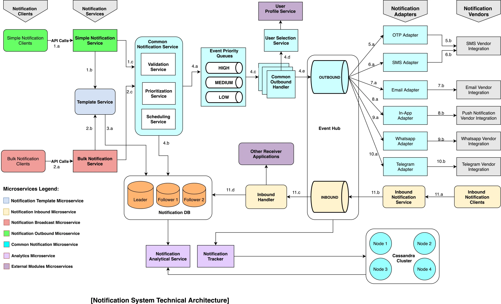

## Notification System Architecture

### Objective
Design an enterprise-level system architecture to support email, SMS, chat, and other public social app integrations using APIs. This architecture is generic and can be customized for various business use cases. It emphasizes high availability, high performance, and analytical services to cater to modern distributed applications.

### Functional Requirements
- Send notifications
- Prioritize notifications
- Send notifications based on customer’s saved preferences
- Single/simple and bulk notification messages
- Analytics use cases for various notifications
- Reporting of notification messages

### Non-functional Requirements (NFR)
- High performance
- Highly available (HA)
- Low latency
- Extendable/Pluggable design
- Support for Android/iOS mobile and desktop/laptop web browsers
- API integration with all notification modules and external integrations
- Scalable for higher load on-prem and on public cloud services

### System Design Architecture


### Solution Design Considerations and Components:

1. **Notification Clients:**
    - Bulk Notification clients: Send bulk notification(s).
    - Simple Notification clients: Send single notification(s).

2. **Notification Services:**
    - Simple Notification Service: Handles simple notification requests.
    - Bulk Notification Service: Handles bulk notification requests.
    - Manages notification messages, persists sent messages to databases, and maintains activity logs.

3. **Template Service:**
    - Manages ready-to-use templates for OTP, SMS, Email, chat, and other push notification messages.

4. **User Selection Service:**
    - Chooses target users and various application modules based on customer preferences.

5. **User Profile Service:**
    - Manages users' profiles and preferences.
    - Provides features like unsubscribing for notifications and notification receiving frequency.

6. **Common Notification Services:**
    - Scheduling Service: Provides APIs to schedule notifications.
    - Validation Service: Validates notification messages against business rules and expected formats.
    - Event Priority Queues (Event Hub): Provides event hub service to consume messages from notification services.

7. **Notification Analytical Service:**
    - Performs analytics, identifies notification usage trends, and provides reporting.

8. **Notification Tracker:**
    - Tracks all sent notifications and captures metadata.

9. **Cassandra Database Cluster:**
    - Persists all notifications for analytics and reporting purposes.

10. **Inbound Notification Service:**
    - Exposes API endpoint to receive inbound messages.

11. **Inbound Event Hub:**
    - Queues and processes all incoming notification messages.

12. **Inbound Handler:**
    - Consumes incoming notification messages from the Inbound Event Hub.

13. **Inbound Notification Clients:**
    - Receives inbound notification messages from internal and external sources/applications.

### Usage Recommendations
- Implement using microservice architecture.
- Deploy on Kubernetes containers for full cloud-native modern system.

### Getting Started
1. Clone the repository.
2. Follow the directory structure for better organization.
3. Use provided scripts for building, deploying, and testing the application.

### Build
```bash
./build.sh
```

### Deploy
```bash
./deploy.sh
```

### Test
```bash
./test.sh
```

Feel free to provide feedback and suggestions for improvement!